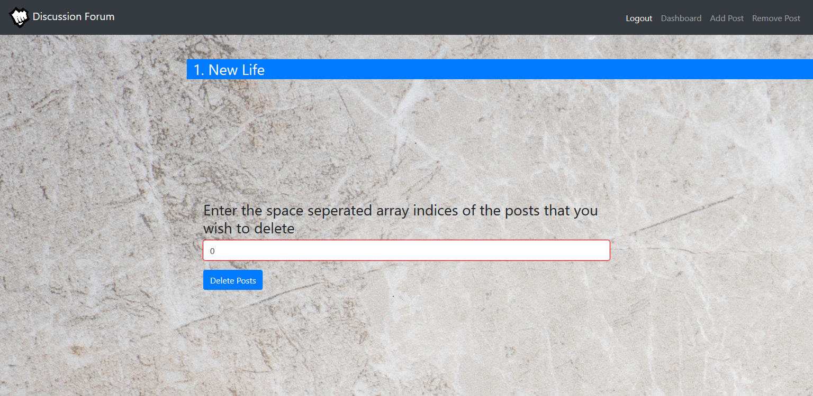

Discussion Forum — A responsive dynamic web application
It’s a very simple web app designed using bootstrap and firebase. You
have to sign up in order to login. After you have logged in you can see
other people’s post on the dashboard. You can add new post and delete
already created posts. You can also see what’s trending (it redirects you
to an iframe that has a news site embeded in it.). Once you are done you
can log out so that other users can use the site.
I created this project when i had limited knowledge of web toolkits. I
have improved a lot since then. Still i consider it a good startpoint.

**1) Home page**

  

  

**2) Responsive when screen size is reduced 
(see the nav bar)**

  

**3) Trending section that uses an iframe**

  

**4) Sign Up page**

  

**5) Sign Up success**

  

**6) Dashboard with posts**

  

**7) Create a new post**

  
  
**8) Post successfully created**

  

**9) Dashboard Updated**

  

**10) Remove post**

  

  

  

**11) Firebase config**

  

  
